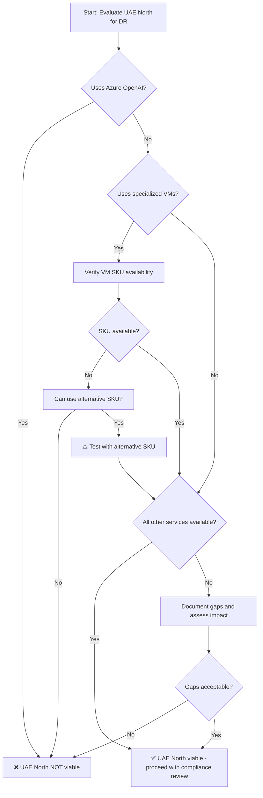

# Azure Service Availability Analysis: UK South vs UAE North

**Document Version:** 1.0  
**Last Updated:** February 5, 2026  
**Analysis Date:** February 2026

---

## Executive Summary

This document provides a detailed analysis of Azure service availability differences between **UK South** and **UAE North** regions. The analysis identifies critical services that are available in UK South but have limited, preview-only, or no availability in UAE North as of February 2026.

> [!CAUTION]
> **Critical Finding:** Several key Azure services commonly used in production applications have limited or NO availability in UAE North. This creates significant migration risks for DR scenarios.

---

## Table of Contents

1. [Methodology](#methodology)
2. [Service Availability Summary](#service-availability-summary)
3. [Critical Service Gaps](#critical-service-gaps)
4. [Services in Preview/Limited Availability](#services-in-previewlimited-availability)
5. [Services Available in Both Regions](#services-available-in-both-regions)
6. [Impact Assessment](#impact-assessment)
7. [Recommendations](#recommendations)
8. [References](#references)

---

## Methodology

### Research Approach

This analysis was conducted using:
- Official Microsoft Azure Products by Region documentation (February 2026)
- Azure service-specific documentation and release notes
- Microsoft Learn technical documentation
- Azure community forums and support channels
- Cross-verification with multiple sources

### Service Categories

Azure services are classified into three categories:

| Category | Deployment Strategy | Availability Timeline |
|----------|-------------------|---------------------|
| **Foundational** | Available in all recommended regions | Within 90 days of region GA |
| **Mainstream** | Available in all recommended regions | Within 90 days of service GA |
| **Strategic** | Demand-driven deployment | Variable, based on customer demand |

### Region Classifications

| Region | Type | Launch Date | Availability Zones | Paired Region |
|--------|------|-------------|-------------------|---------------|
| **UK South** | Recommended | 2016 | 3 zones | UK West |
| **UAE North** | Recommended (Restricted Access) | 2019 | 3 zones | UAE Central |

> [!NOTE]
> UAE North requires an Azure region access request and is not automatically available to all customers.

---

## Service Availability Summary

### High-Level Comparison

| Service Category | UK South | UAE North | Gap Analysis |
|-----------------|----------|-----------|--------------|
| **Compute** | ✅ Full availability | ⚠️ Limited VM SKUs | Some specialized VMs unavailable |
| **AI/ML Services** | ✅ Full availability | ❌ Critical gaps | Azure OpenAI severely limited |
| **Data & Analytics** | ✅ Full availability | ✅ Good availability | Minor gaps |
| **Networking** | ✅ Full availability | ✅ Full availability | Parity achieved |
| **Storage** | ✅ Full availability | ✅ Full availability | Parity achieved |
| **Security** | ✅ Full availability | ✅ Good availability | Recent improvements |
| **Developer Tools** | ✅ Full availability | ⚠️ Some limitations | Minor gaps |

---

## Critical Service Gaps

### 1. ❌ Azure OpenAI Service

**Status in UK South:** ✅ Generally Available (GA) since June 12, 2023

**Status in UAE North:** ❌ **NOT AVAILABLE** for most models

#### Detailed Findings:

| Model Family | UK South | UAE North | Impact |
|--------------|----------|-----------|--------|
| **GPT-4 Series** | ✅ Available (all versions) | ❌ Not available | **CRITICAL** |
| **GPT-5 Series** | ✅ Available (gpt-5, gpt-5-mini, gpt-5.1) | ❌ Not available | **CRITICAL** |
| **GPT-3.5 Turbo** | ✅ Available | ❌ Not available | **HIGH** |
| **GPT-4 Turbo** | ✅ Available | ❌ Not available | **CRITICAL** |
| **GPT-4o, GPT-4o-mini** | ✅ Available | ❌ Not available | **CRITICAL** |
| **Image Models** | ✅ Available | ⚠️ Limited (gpt-image-1-mini, gpt-image-1.5 only) | **HIGH** |

**Last Verified:** February 8, 2024 - Microsoft documentation confirmed "none of the Azure OpenAI models are available in UAE North Region"

**Business Impact:**
- Applications using Azure OpenAI for chatbots, content generation, or AI features **CANNOT** be replicated to UAE North
- No local inference capability - processing may route to other regions (data sovereignty issue)
- Unclear timeline for full Azure OpenAI availability in UAE North

> [!WARNING]
> **If your application uses Azure OpenAI Service, UAE North is NOT a viable DR option as of February 2026.**

---

### 2. ⚠️ Virtual Machine SKUs

**Status:** Limited availability of specialized VM types in UAE North

#### Findings:

**UK South:**
- ✅ Full range of VM families (D, E, F, M, N, etc.)
- ✅ Latest AMD Turin series (Dasv7, Easv7, Fasv7) available since January 2026
- ✅ GPU-enabled VMs (NC, ND, NV series)
- ✅ High-memory VMs (M series)

**UAE North:**
- ⚠️ Limited variety of VM SKUs compared to established regions
- ⚠️ Some specialized/less common VM types not available
- ⚠️ Newer VM families may arrive later than UK South

**Source:** Reddit community discussion (October 2024) indicated VM SKU limitations in UAE North

**Business Impact:**
- May need to use different VM sizes in DR region
- Performance characteristics may differ
- Cost implications if forced to use larger VMs
- Testing required to validate application performance on available SKUs

---

### 3. ⚠️ Azure Cognitive Services (Partial Gaps)

**Status:** Most services available, but some gaps exist

#### Available in Both Regions:

| Service | UK South | UAE North | Notes |
|---------|----------|-----------|-------|
| **Face API** | ✅ GA | ✅ GA | Parity achieved |
| **Language Understanding (LUIS)** | ✅ GA | ✅ GA | Parity achieved |
| **Anomaly Detector** | ✅ GA | ✅ GA (since 2022) | Parity achieved |
| **Immersive Reader** | ✅ GA | ✅ GA (since 2022) | Parity achieved |
| **QnA Maker** | ✅ GA | ✅ GA | Parity achieved |
| **Speaker Recognition** | ✅ GA | ✅ GA | Parity achieved |
| **Translator** | ✅ GA | ✅ GA | Parity achieved |

#### Potential Gaps:

- Some newer Cognitive Services features may arrive in UAE North later
- Specific model versions or capabilities may differ
- Recommend verifying each specific Cognitive Service API version used

---

## Services in Preview/Limited Availability

### Services Requiring Verification

The following services should be verified for production readiness in UAE North:

| Service | UK South Status | UAE North Status | Action Required |
|---------|----------------|------------------|-----------------|
| **Azure Monitor Application Insights** | ✅ GA | ⚠️ Was in Preview (Nov 2020) | Verify current GA status |
| **Azure Log Analytics** | ✅ GA | ⚠️ Was in Preview (Nov 2020) | Verify current GA status |
| **Specific Azure AI Search features** | ✅ GA | ✅ GA (confirmed Feb 2026) | ✅ Verified |
| **Latest VM generations** | ✅ GA | ⚠️ May lag behind | Check specific SKUs |

> [!TIP]
> Services that were in preview in 2020-2022 are likely GA now, but explicit verification is recommended for production DR planning.

---

## Services Available in Both Regions

### ✅ Confirmed Parity (as of February 2026)

#### Compute & Infrastructure

| Service | UK South | UAE North | Notes |
|---------|----------|-----------|-------|
| **Virtual Machines** | ✅ GA | ✅ GA | Core VM families available |
| **Availability Zones** | ✅ 3 zones | ✅ 3 zones | Full parity |
| **Azure Kubernetes Service (AKS)** | ✅ GA | ✅ GA | Full support |
| **App Service** | ✅ GA | ✅ GA | Full support |
| **Container Instances** | ✅ GA | ✅ GA | Full support |
| **Azure Functions** | ✅ GA | ✅ GA | Full support |

#### Data & Analytics

| Service | UK South | UAE North | Notes |
|---------|----------|-----------|-------|
| **Azure SQL Database** | ✅ GA | ✅ GA | Full support including geo-replication |
| **Cosmos DB** | ✅ GA | ✅ GA | Multi-region writes supported |
| **Azure Databricks** | ✅ GA | ✅ GA (since 2022) | Full support |
| **Azure Machine Learning** | ✅ GA | ✅ GA (since April 2022) | Full support |
| **Azure Synapse Analytics** | ✅ GA | ✅ GA | Requires verification |
| **Azure Data Factory** | ✅ GA | ✅ GA | Full support |

#### Storage

| Service | UK South | UAE North | Notes |
|---------|----------|-----------|-------|
| **Blob Storage** | ✅ GA | ✅ GA | Full support |
| **Azure Files** | ✅ GA | ✅ GA | Full support |
| **Disk Storage** | ✅ GA | ✅ GA | Full support |
| **Zone Redundant Storage (ZRS)** | ✅ GA | ✅ GA (since Oct 2023) | Full support |
| **Azure NetApp Files** | ✅ GA | ✅ GA | Full support with cross-region replication |

#### Networking

| Service | UK South | UAE North | Notes |
|---------|----------|-----------|-------|
| **Virtual Network** | ✅ GA | ✅ GA | Full support |
| **VPN Gateway** | ✅ GA | ✅ GA | Full support |
| **ExpressRoute** | ✅ GA | ✅ GA | Full support |
| **Azure Firewall** | ✅ GA | ✅ GA | Full support |
| **Load Balancer** | ✅ GA | ✅ GA | Full support |
| **Application Gateway** | ✅ GA | ✅ GA | Full support |

#### Security & Identity

| Service | UK South | UAE North | Notes |
|---------|----------|-----------|-------|
| **Azure Active Directory** | ✅ GA | ✅ GA | Global service |
| **Azure Sentinel** | ✅ GA | ✅ GA (since 2022) | AI-driven security |
| **Azure Bastion** | ✅ GA | ✅ GA (since 2022) | Secure VM access |
| **Key Vault** | ✅ GA | ✅ GA | Full support |
| **Azure DDoS Protection** | ✅ GA | ✅ GA | Full support |

#### Specialized Services

| Service | UK South | UAE North | Notes |
|---------|----------|-----------|-------|
| **Azure VMware Solution** | ✅ GA | ✅ GA | AV36P, AV48, AV64 hosts available |
| **Azure NetApp Files** | ✅ GA | ✅ GA | Data sovereignty compliant |
| **Azure Site Recovery** | ✅ GA | ✅ GA | Supports cross-region DR |

---

## Impact Assessment

### Risk Matrix

| Service Gap | Likelihood of Use | Business Impact | Overall Risk |
|-------------|------------------|-----------------|--------------|
| **Azure OpenAI unavailable** | High (growing adoption) | Critical | 🔴 **CRITICAL** |
| **Limited VM SKUs** | Medium | Medium | 🟡 **MEDIUM** |
| **Newer services delayed** | Low | Low-Medium | 🟢 **LOW** |

### Application Architecture Impact

#### High-Risk Architectures (UAE North NOT Recommended):

1. **AI-Powered Applications**
   - Chatbots using Azure OpenAI
   - Content generation services
   - AI-assisted search
   - Intelligent document processing
   - **Recommendation:** ❌ Do NOT use UAE North for DR

2. **Specialized Compute Workloads**
   - GPU-intensive ML training
   - High-memory databases (M-series VMs)
   - Latest-generation VM requirements
   - **Recommendation:** ⚠️ Verify VM SKU availability first

#### Low-Risk Architectures (UAE North Viable):

1. **Traditional Web Applications**
   - Standard compute (D/E series VMs)
   - Azure SQL Database
   - Blob/File storage
   - **Recommendation:** ✅ UAE North suitable

2. **Data Analytics Platforms**
   - Azure Databricks
   - Azure Synapse Analytics
   - Data Factory pipelines
   - **Recommendation:** ✅ UAE North suitable

3. **Container-Based Applications**
   - AKS clusters
   - Container Instances
   - App Service containers
   - **Recommendation:** ✅ UAE North suitable

---

## Recommendations

### Immediate Actions

#### 1. Service Inventory Audit

Create a comprehensive inventory of all Azure services currently in use:

```markdown
## Service Audit Template

### AI/ML Services
- [ ] Azure OpenAI Service (GPT models)
- [ ] Azure Machine Learning
- [ ] Cognitive Services (specify which APIs)
- [ ] Azure Databricks

### Compute
- [ ] Virtual Machines (list specific SKUs)
- [ ] Azure Kubernetes Service
- [ ] App Service
- [ ] Azure Functions

### Data Services
- [ ] Azure SQL Database
- [ ] Cosmos DB
- [ ] Storage Accounts
- [ ] Azure Synapse Analytics

### Specialized Services
- [ ] Azure VMware Solution
- [ ] Azure NetApp Files
- [ ] GPU-enabled VMs
```

#### 2. Service Availability Verification

For each service identified, verify:

| Verification Step | How to Check | Documentation Link |
|------------------|--------------|-------------------|
| **Service availability in UAE North** | Azure Products by Region page | [Products by Region](https://azure.microsoft.com/en-us/explore/global-infrastructure/products-by-region/) |
| **Feature parity** | Service-specific documentation | Check each service's docs |
| **Preview vs GA status** | Azure Updates page | [Azure Updates](https://azure.microsoft.com/en-us/updates/) |
| **VM SKU availability** | Azure Portal (create VM wizard) | Test in UAE North subscription |

#### 3. Gap Analysis Documentation

Document all identified gaps:

```markdown
## Service Gap Report

### Critical Gaps (Blockers)
- Service: Azure OpenAI
- Impact: Cannot replicate AI chatbot functionality
- Mitigation: None available - UAE North not viable

### Medium Gaps (Workarounds Available)
- Service: Specific VM SKU (e.g., M-series)
- Impact: Need to use alternative VM size
- Mitigation: Test with E-series VMs

### Low Gaps (Acceptable)
- Service: Newer preview features
- Impact: Can wait for GA
- Mitigation: Use GA features only
```

### Decision Framework

Use this decision tree to determine if UAE North is viable:



### Alternative Strategies

If UAE North is not viable due to service gaps:

#### Option 1: Maintain UK West as DR

**Pros:**
- ✅ Full service parity
- ✅ Same geography (UK)
- ✅ Simpler compliance
- ✅ Lower latency
- ✅ Official region pair

**Cons:**
- ❌ Doesn't meet UAE North requirement
- ❌ No Middle East presence

#### Option 2: Hybrid Approach

**Strategy:**
- UK West: Primary DR for all services
- UAE North: Secondary DR for compatible services only
- Segregate workloads by service availability

**Architecture:**
```
UK South (Primary)
├── All Services
│
├─→ UK West (Primary DR)
│   └── Full replication of all services
│
└─→ UAE North (Secondary DR - Selective)
    └── Only services with confirmed availability
        ├── Standard VMs
        ├── Azure SQL
        ├── Storage
        └── AKS
```

#### Option 3: Service-Specific Routing

**Strategy:**
- Deploy most services to UAE North
- Route AI/OpenAI workloads to UK South or UK West
- Accept cross-region latency for AI features

**Considerations:**
- Data sovereignty implications
- Increased complexity
- Higher latency for AI features
- Potential compliance issues

---

## Verification Checklist

Before proceeding with UAE North as DR region, complete this checklist:

### Technical Verification

- [ ] **Service Inventory Complete**
  - All Azure services documented
  - Versions and SKUs identified
  - Dependencies mapped

- [ ] **Availability Confirmed**
  - Each service verified in UAE North
  - GA status confirmed (not preview)
  - Feature parity validated

- [ ] **VM SKUs Tested**
  - Required VM sizes available
  - Performance tested
  - Cost comparison completed

- [ ] **Azure OpenAI Assessment**
  - ❌ Confirmed NOT available (as of Feb 2026)
  - Alternative solutions identified (if applicable)
  - Business impact assessed

- [ ] **Network Latency Tested**
  - 229ms latency impact assessed
  - Application performance validated
  - RPO/RTO recalculated

### Compliance Verification

- [ ] **Data Transfer Mechanisms**
  - UK IDTA or SCCs implemented
  - Transfer Risk Assessment completed
  - Documentation procedures established

- [ ] **UAE PDPL Compliance**
  - Cross-border transfer requirements met
  - Data residency confirmed
  - Audit procedures defined

- [ ] **Industry Regulations**
  - Sector-specific requirements reviewed
  - Regulatory approval obtained (if required)
  - Compliance documentation prepared

### Business Verification

- [ ] **Stakeholder Approval**
  - Executive leadership informed
  - Legal team sign-off
  - Compliance team approval
  - Security team review

- [ ] **Cost Analysis**
  - Cross-geography costs calculated
  - Budget approved
  - ROI justified

- [ ] **Risk Assessment**
  - Service gaps documented
  - Mitigation strategies defined
  - Contingency plans prepared

---

## Key Findings Summary

### ❌ Critical Blockers

1. **Azure OpenAI Service**
   - Status: NOT available in UAE North (as of Feb 2026)
   - Impact: Applications using GPT models cannot be replicated
   - Recommendation: **UAE North is NOT viable if you use Azure OpenAI**

### ⚠️ Significant Concerns

2. **VM SKU Limitations**
   - Status: Some specialized VMs not available
   - Impact: May need alternative VM sizes
   - Recommendation: Verify and test required SKUs

3. **Service Deployment Lag**
   - Status: Newer services arrive later in UAE North
   - Impact: Feature parity gaps for cutting-edge services
   - Recommendation: Plan for delayed availability

### ✅ Positive Findings

4. **Core Services Available**
   - Compute, Storage, Networking: Full parity
   - Data services: Azure SQL, Cosmos DB, Databricks all available
   - Security: Recent improvements (Sentinel, Bastion)

5. **Infrastructure Maturity**
   - 3 Availability Zones
   - Zone Redundant Storage
   - Enterprise-grade certifications

---

## Next Steps

### Week 1-2: Assessment Phase

1. **Complete Service Inventory**
   - Use the audit template above
   - Document all services and versions
   - Identify dependencies

2. **Verify Service Availability**
   - Check each service in Azure Products by Region
   - Test VM SKU availability in portal
   - Confirm GA status for critical services

3. **Document Gaps**
   - Create gap analysis report
   - Assess business impact
   - Identify blockers vs. acceptable gaps

### Week 3-4: Decision Phase

4. **Stakeholder Review**
   - Present findings to leadership
   - Review compliance implications
   - Discuss alternative strategies

5. **Make Go/No-Go Decision**
   - UAE North viable: Proceed to implementation planning
   - UAE North not viable: Maintain UK West or explore alternatives
   - Hybrid approach: Define service segregation strategy

### Week 5+: Implementation (if approved)

6. **Pilot Deployment**
   - Deploy non-critical workloads first
   - Validate performance and functionality
   - Test failover procedures

7. **Full Migration**
   - Phased approach by service
   - Continuous monitoring
   - Regular DR testing

---

## References

### Official Microsoft Documentation

1. [Azure Products by Region](https://azure.microsoft.com/en-us/explore/global-infrastructure/products-by-region/)
2. [Azure OpenAI Service Models](https://learn.microsoft.com/en-us/azure/ai-services/openai/concepts/models)
3. [Azure Region Pairs](https://learn.microsoft.com/en-us/azure/reliability/cross-region-replication-azure)
4. [Azure Service Availability](https://learn.microsoft.com/en-us/azure/reliability/availability-service-by-category)

### Service-Specific Documentation

5. [Azure OpenAI Regional Availability](https://learn.microsoft.com/en-us/azure/ai-services/openai/concepts/models#model-summary-table-and-region-availability)
6. [Azure Machine Learning Regions](https://azure.microsoft.com/en-us/explore/global-infrastructure/products-by-region/?products=machine-learning-service)
7. [Azure Databricks Regions](https://learn.microsoft.com/en-us/azure/databricks/resources/supported-regions)
8. [Azure VMware Solution Availability](https://learn.microsoft.com/en-us/azure/azure-vmware/introduction)
9. [Azure NetApp Files Regions](https://learn.microsoft.com/en-us/azure/azure-netapp-files/azure-netapp-files-region-availability)

### Community & Support

10. [Azure Updates](https://azure.microsoft.com/en-us/updates/)
11. [Azure Community Forums](https://techcommunity.microsoft.com/t5/azure/ct-p/Azure)
12. [Azure Support](https://azure.microsoft.com/en-us/support/options/)

---

## Document Maintenance

| Version | Date | Changes | Author |
|---------|------|---------|--------|
| 1.0 | 2026-02-05 | Initial service availability analysis | Azure DR Assessment Team |

### Review Schedule

- **Monthly:** Check Azure Updates for new service announcements
- **Quarterly:** Re-verify critical service availability
- **Annually:** Full service inventory audit

### Contact Information

For questions regarding this analysis:
- **Technical Questions:** Azure Solutions Architect
- **Service Availability:** Microsoft Account Team
- **Azure Support:** Submit region-specific inquiry

---

> [!IMPORTANT]
> **Critical Recommendation:** If your application uses **Azure OpenAI Service**, UAE North is **NOT a viable DR option** as of February 2026. Consider maintaining UK West as your DR region or implementing a hybrid strategy.

---

*Last Updated: February 5, 2026*  
*Next Review: March 5, 2026*
